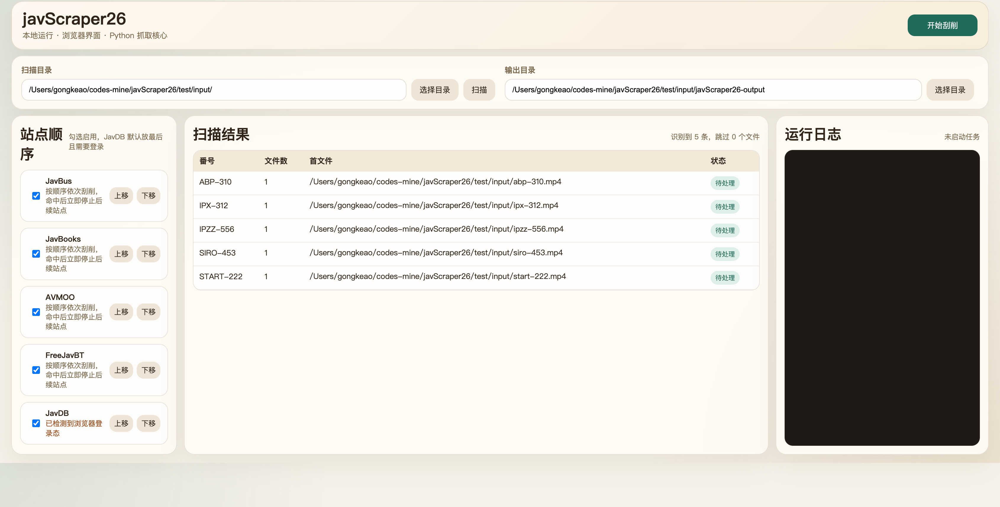
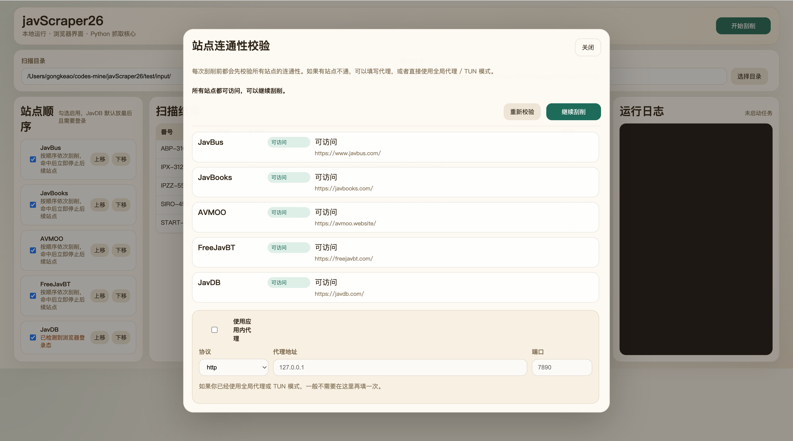
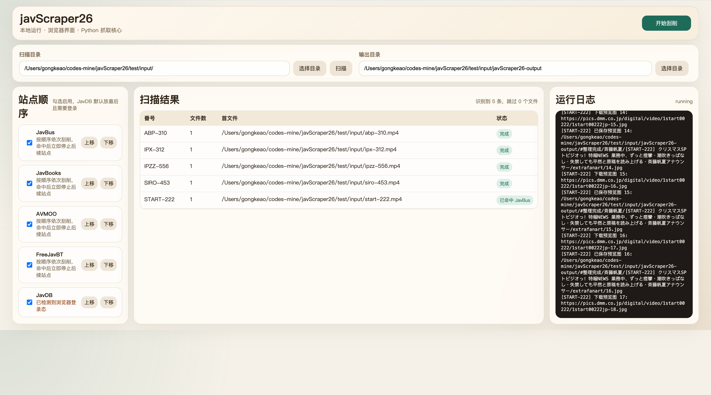

# javScraper26

一个本地运行的 JAV 元数据刮削器，界面使用浏览器页面呈现，抓取核心仍然是 Python。

现在支持两种运行模式：

- `普通 WebUI`
  - 扫描目录、批量刮削、整理输出
- `Emby 服务模式`
  - 作为 Emby 插件的元数据后端，提供电影元数据与图片接口，并显示服务日志

仓库内也已经包含 Emby 插件子项目：

- `emby-plugin/JavScraper26.EmbyPlugin/`

当前内置站点：

- `JavBus`
- `JavBooks`
- `AVBASE`
- `JAV321`
- `FC2`
- `Caribbeancom`
- `CaribbeancomPR`
- `HEYZO`
- `HeyDouga`
- `1Pondo`
- `10musume`
- `PACOPACOMAMA`
- `MURAMURA`
- `AVMOO`
- `FreeJavBT`
- `JavDB`

## 运行

```bash
cd javScraper26
python3 -m venv .venv
source .venv/bin/activate
pip install -r requirements.txt
python3 app.py
```

启动后访问根路径 `/` 会先进入模式选择页。

如果你想直接进入某种模式：

```bash
JAVSCRAPER_MODE=webui python3 app.py
JAVSCRAPER_MODE=service JAVSCRAPER_PORT=8765 python3 app.py
```

## Web 界面功能

### 模式选择页

- 根路径 `/` 现在是模式选择页
- 可进入：
  - 普通 WebUI：`/webui`
  - Emby 服务模式：`/service`

### 普通 WebUI

- 选择待扫描目录
- 选择结果输出目录
- 扫描视频文件并识别番号
- 通过上移/下移编排站点执行顺序
- 按顺序逐站刮削
- 在浏览器界面中查看日志和逐条状态

### Emby 服务模式

- 提供健康检查：`/emby-api/v1/health`
- 提供电影解析：`/emby-api/v1/movies/resolve`
- 提供电影详情：`/emby-api/v1/movies/{provider}/{id}`
- 提供图片接口：`/emby-api/v1/images/{primary|thumb|backdrop}/{provider}/{id}`
- 展示最近 Emby API 请求和抓取日志
- 第一版只支持 Emby `Movie library`

## 界面截图

截图文件建议放在：

```text
docs/images/
```

当前 `README` 预留的截图文件名如下：

- `docs/images/main-ui.png`
- `docs/images/connectivity-dialog.png`
- `docs/images/scrape-result.png`

你截图完成后，只需要把对应图片放进去即可。如果文件名不同，把下面的路径一起改掉就行。

### 主界面



### 连通性检测弹窗



### 刮削结果



## 输出结果

当前输出结构已经调整为常见刮削整理工具的目录方式。

每个站点的输出目录下会生成：

- `#整理完成/`
- `#整理完成/女优名/`
- `#整理完成/女优名/[番号] 标题/`

影片目录中默认包含：

- `番号.ext`
- `movie.nfo`
- `fanart.jpg`
- `poster.jpg`
- `extrafanart/`

站点根目录下还会生成：

- `manifest.csv`

示例：

```text
FreeJavBT/
├── #整理完成/
│   └── #未知女优/
│       └── [ABP-310] 天然成分由來 輝月杏梨汁120％/
│           ├── ABP-310.mp4
│           ├── movie.nfo
│           ├── fanart.jpg
│           ├── poster.jpg
│           └── extrafanart/
└── manifest.csv
```

## 当前行为说明

- 当前会将原视频文件移动到整理目录
- `poster.jpg` 目前直接由 `fanart.jpg` 复制生成，还没有接入单独裁剪逻辑
- `extrafanart/` 会尽量下载站点提供的预览图，失败的单张会自动跳过
- 没有女优信息时会落到 `#未知女优`
- Emby 服务模式下，插件请求级代理参数优先于后端默认代理环境变量

## 本地测试

项目内已经有一套本地测试输出目录：

- `test/input/`
- `test/JavBus/`
- `test/JavDB/`
- `test/AVMOO/`
- `test/FreeJavBT/`
- `test/JavBooks/`

如果想脚本化重跑，可以复用当前思路：

1. 把待测文件放进 `test/input/`
2. 逐站点创建 `ScrapePipeline`
3. 把输出目录指向 `test/<站点名>/`

## JavDB 说明

`JavDB` 站点依赖浏览器 Cookie。

当前实现会优先尝试读取本机 Chromium 浏览器中 `javdb.com` 的 Cookie。如果浏览器未登录、Cookie 已过期，`JavDB` provider 会失败，但不会阻断其他站点继续执行。

实际运行时还要注意：

- `JavDB` 成功率受浏览器登录态、`cf_clearance` 和当前网络环境影响
- 某些站点会出现站点侧限流、连接中断或部分影片缺失，这属于真实网络结果，不一定是代码错误

## 开源协议

本项目采用以下协议发布：

- `GPL-3.0-or-later`
- `Anti-996 License`

项目根目录已包含完整的 `LICENSE` 文件。

这样处理的目的，是让项目当前的实现方式、再分发方式和许可证约束保持一致，也避免后续改成更宽松协议时带来的不确定风险。

如果你分发源码、打包产物或修改后的版本，建议一并保留：

- `LICENSE`
- `README.md`

## 打包 macOS 应用

当前项目已经可以在 macOS 上打包为 `.app`。

项目内已提供打包脚本：

```bash
scripts/build_macos_app.sh
```

默认产物路径：

```text
dist/javScraper26.app
```

补充说明：

- `build/` 目录只是 PyInstaller 的中间构建目录，不要直接运行里面的可执行文件
- 实际应运行 `dist/javScraper26.app`，或者目录版产物 `dist/javScraper26/javScraper26`
- 新版应用启动后，会先进入模式选择页
- 当前打包脚本会优先使用 `/usr/bin/python3`
- 脚本会把 `webui/` 静态页面一起打进应用包
- 另外还会生成一个目录版产物：`dist/javScraper26/`

如果你想在无头场景下直接跑服务模式，可以设置：

```bash
JAVSCRAPER_MODE=service
JAVSCRAPER_PORT=8765
JAVSCRAPER_DISABLE_BROWSER=1
```

## Emby 插件

仓库内已包含 Emby 插件源码：

```text
emby-plugin/JavScraper26.EmbyPlugin/
```

本机编译命令：

```bash
dotnet build -c Release emby-plugin/JavScraper26.EmbyPlugin/JavScraper26.EmbyPlugin.csproj
```

当前 Release 安装包：

```text
emby-plugin/JavScraper26.EmbyPlugin/bin/Emby.JavScraper26@v0.1.0.zip
```

当前 Release DLL：

```text
emby-plugin/JavScraper26.EmbyPlugin/bin/Release/net6.0/JavScraper26.EmbyPlugin.dll
```

重要说明：

- Emby 4.9.3.0 当前运行在 `.NET 6`
- 插件也必须编译为 `net6.0`
- 如果插件编译成 `net8.0`，Emby 启动日志会报 `System.Runtime, Version=8.0.0.0` 无法加载

本机 Emby 实际目录：

```text
/Users/gongkeao/.config/emby-server/
```

插件目录：

```text
/Users/gongkeao/.config/emby-server/plugins/
```

## 打包 Windows EXE

当前工作环境是 macOS，不能直接产出 Windows `.exe`。

项目内已提供 Windows 打包脚本和 `PyInstaller` 依赖，需在 Windows 机器上执行：

```bat
scripts\build_windows_exe.bat
```

Windows 打包完成后，产物默认在：

```text
dist\javScraper26\javScraper26.exe
```

补充说明：

- Windows 打包脚本会使用独立的虚拟环境目录：`.venv-windows-build`
- 脚本在任一步失败时会直接退出，避免出现失败后仍显示构建成功的误导

如果你当前主要在 macOS 上开发，也可以直接使用仓库内的 GitHub Actions 工作流自动构建 Windows 包：

```text
.github/workflows/build-windows.yml
```

这个工作流会在 GitHub 的 Windows runner 上：

- 执行 `scripts\build_windows_exe.bat`
- 生成目录版产物 `release\javScraper26-windows\`
- 额外打包 `release\javScraper26-windows.zip`
- 将构建结果上传为 Actions artifact

仓库内也提供了对应的 macOS 自动构建工作流：

```text
.github/workflows/build-macos.yml
```

它会在 GitHub 的 macOS runner 上执行 `scripts/build_macos_app.sh`，并上传：

- `release/javScraper26-macos/`
- `release/javScraper26-macos.zip`
