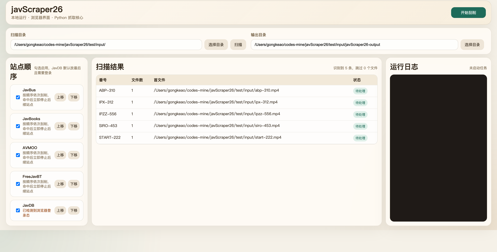
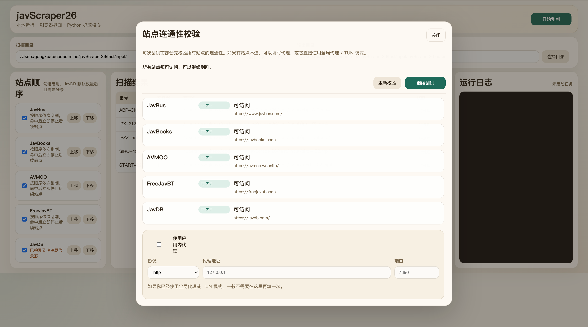
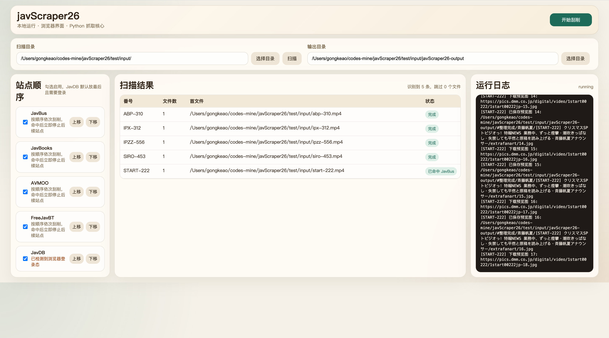

# javScraper26

一个本地运行的 JAV 元数据刮削器，提供两种用法：

- `普通 WebUI`
  适合扫描本地目录、批量抓取元数据、整理输出目录
- `Emby 服务模式`
  适合作为 Emby 插件后端，长期后台运行

## 你能做什么

- 扫描视频目录并识别番号
- 按番号类型自动分流站点
- 抓取标题、简介、演员、系列、片商、发布日期等信息
- 输出 `movie.nfo`、`fanart.jpg`、`thumb.jpg`、`poster.jpg`、`extrafanart/`
- 按 `女优名/[番号] 标题` 整理目录
- 给 Emby 提供元数据和图片接口

## 支持的站点

普通番号：

- `JAV321`
- `JavBooks`
- `AVBASE`
- `FreeJavBT`
- `JavBus`
- `AVMOO`
- `JavDB`

特殊番号：

- `FC2`
- `Caribbeancom`
- `CaribbeancomPR`
- `HEYZO`
- `HeyDouga`
- `1Pondo`
- `10musume`
- `PACOPACOMAMA`
- `MURAMURA`

## 快速开始

### 方式 1：本地直接运行

环境要求：

- `Python 3.10+`
- `pip`

安装并启动：

```bash
cd javScraper26
python3 -m venv .venv
source .venv/bin/activate
pip install -r requirements.txt
python3 app.py
```

默认行为：

- 监听 `127.0.0.1`
- 端口随机
- 自动打开浏览器
- 先进入模式选择页

安装项目后也可以直接运行：

```bash
javscraper26
```

### 方式 2：Docker 公共镜像

Docker 镜像地址：

- [gongkeao/javscraper26](https://hub.docker.com/r/gongkeao/javscraper26)

直接拉取稳定版：

```bash
docker pull gongkeao/javscraper26:latest
```

启动：

```bash
docker run -d \
  --name javscraper26 \
  -p 8765:8765 \
  -e JAVSCRAPER_MODE=service \
  -e JAVSCRAPER_HOST=0.0.0.0 \
  -e JAVSCRAPER_PORT=8765 \
  -e JAVSCRAPER_DISABLE_BROWSER=1 \
  -v "$(pwd)/docker-data/input:/media/input" \
  -v "$(pwd)/docker-data/output:/media/output" \
  gongkeao/javscraper26:latest
```

Docker 版默认只支持：

- `Emby 服务模式`

不支持：

- 容器内普通 WebUI 的系统目录选择框
- Docker 中的 `JavDB` 浏览器登录态读取

## 启动方式

### 模式选择页

```bash
python3 app.py
```

打开后可在首页选择：

- `普通 WebUI`
- `Emby 服务模式`

### 直接启动普通 WebUI

```bash
JAVSCRAPER_MODE=webui python3 app.py
```

### 直接启动 Emby 服务模式

```bash
JAVSCRAPER_MODE=service JAVSCRAPER_PORT=8765 python3 app.py
```

### 局域网访问 / 服务器运行

```bash
JAVSCRAPER_MODE=service \
JAVSCRAPER_HOST=0.0.0.0 \
JAVSCRAPER_PORT=8765 \
JAVSCRAPER_DISABLE_BROWSER=1 \
python3 app.py
```

## 普通 WebUI 怎么用

访问：

- `/webui`

操作步骤：

1. 选择 `扫描目录`
2. 如有需要，选择 `输出目录`
3. 点击 `扫描`
4. 检查识别出的番号列表
5. 调整站点顺序
6. 点击 `开始刮削`
7. 如有需要，在连通性弹窗里填写代理
8. 点击 `继续刮削`
9. 等待任务完成

说明：

- 如果不手动选择输出目录，默认会使用：
  - `扫描目录/javScraper26-output`
- 站点顺序只能在各自分组内调整
- `JavDB` 依赖本机浏览器登录态，未登录时会自动跳过

### 页面截图

模式选择页：


普通 WebUI：



连通性校验：



刮削结果：



## Emby 服务模式怎么用

访问：

- `/service`

服务模式适合：

- 给 Emby 插件提供元数据
- 长时间后台运行
- 查看最近的请求和抓取日志

常用接口：

- `GET /emby-api/v1/health`
- `GET /emby-api/v1/logs/recent`
- `GET /emby-api/v1/movies/resolve`
- `GET /emby-api/v1/movies/{provider}/{id}`
- `GET /emby-api/v1/images/{primary|thumb|backdrop}/{provider}/{id}`

最小验证：

1. 启动服务模式
2. 打开 `http://127.0.0.1:8765/service`
3. 打开 `http://127.0.0.1:8765/emby-api/v1/health`
4. 确认返回 `status=ok`

页面截图：


## Emby 插件怎么用

仓库里已经包含 Emby 插件：

- 插件 zip：
  - `emby-plugin/JavScraper26.EmbyPlugin/bin/Emby.JavScraper26@v0.1.0.zip`
- 插件 DLL：
  - `emby-plugin/JavScraper26.EmbyPlugin/bin/JavScraper26.EmbyPlugin.dll`

### 安装插件

推荐直接安装 zip：

1. 打开 Emby 管理后台
2. 进入 `插件`
3. 选择手动安装 / 上传插件
4. 上传：
   - `Emby.JavScraper26@v0.1.0.zip`
5. 安装后按提示重启 Emby

### 配置插件

插件配置项：

- `Server URL`
  - 例如：`http://127.0.0.1:8765`
- `Enable Proxy`
- `Proxy Protocol`
- `Proxy Host`
- `Proxy Port`

配置步骤：

1. 先启动 `javScraper26` 的服务模式
2. 打开 Emby 插件页
3. 在 `Server URL` 中填写服务地址
4. 如果需要代理，开启 `Enable Proxy` 并填完整代理信息
5. 保存配置
6. 在电影库中执行 `识别` 或 `刷新元数据`

如果 Emby 和 `javScraper26` 不在同一台机器：

- `Server URL` 要填写 Emby 能访问到的地址
- 例如：`http://<宿主机IP>:8765`

## 代理怎么配

### 普通 WebUI

在连通性校验弹窗中填写代理：

- `协议`
- `代理地址`
- `端口`

这会用于：

- 当前批次连通性检查
- 当前批次抓取任务

### Emby 服务模式

服务模式支持两层代理：

1. 服务端默认代理
2. 插件请求级代理

服务端默认代理通过环境变量设置：

```bash
JAVSCRAPER_PROXY_ENABLED=1
JAVSCRAPER_PROXY_PROTOCOL=http
JAVSCRAPER_PROXY_HOST=127.0.0.1
JAVSCRAPER_PROXY_PORT=7890
```

优先级：

- 插件里填了代理时，优先使用插件代理
- 插件没填时，使用服务端默认代理

## 输出结果

每个成功条目会输出到：

```text
<输出目录>/
└── #整理完成/
    └── <女优名或#未知女优>/
        └── [番号] 标题/
```

目录里通常包含：

- `番号.ext`
- `番号-CD2.ext`、`番号-CD3.ext`（多文件时）
- `movie.nfo`
- `fanart.jpg`
- `thumb.jpg`
- `poster.jpg`
- `extrafanart/`

输出根目录还会生成：

- `manifest.csv`

注意：

- 原视频文件会被移动到整理目录
- 如果没拿到最小可用字段，条目不会落盘

## 已知限制

- `JavDB` 依赖本机 Chromium 浏览器登录态
- 未登录或 Cookie 失效时，`JavDB` 会自动跳过
- Docker 首版不支持普通 WebUI 的系统目录选择框
- Docker 中默认不支持 `JavDB` 登录态

## 常用环境变量

- `JAVSCRAPER_MODE`
  - `webui` / `service`
- `JAVSCRAPER_HOST`
  - 默认：`127.0.0.1`
- `JAVSCRAPER_PORT`
  - 服务模式建议固定，例如 `8765`
- `JAVSCRAPER_DISABLE_BROWSER`
  - `1/true/yes/on` 时不自动打开浏览器
- `JAVSCRAPER_PROXY_ENABLED`
- `JAVSCRAPER_PROXY_PROTOCOL`
- `JAVSCRAPER_PROXY_HOST`
- `JAVSCRAPER_PROXY_PORT`

## Docker 镜像版本说明

- 只有 `v*` tag 才会自动发布 Docker 镜像
- 稳定版示例：
  - `v0.2.1` -> `gongkeao/javscraper26:0.2.1`
- 测试版示例：
  - `v0.2.1-test1` -> `gongkeao/javscraper26:0.2.1-test1`
- 只有稳定版本 `vX.Y.Z` 会更新：
  - `gongkeao/javscraper26:latest`

## 开发者补充

如果你需要自己构建：

### 本地 Docker 构建

```bash
docker build -t javscraper26:local .
```

### Docker Compose 本地构建启动

```bash
mkdir -p docker-data/input docker-data/output
docker compose up -d
```

## Docker 故障排查

### 查看容器日志

```bash
# 查看最近 500 行并持续跟踪
docker compose logs --timestamps --tail=500 -f javscraper26

# 直接查看容器当前状态
docker inspect javscraper26 --format 'status={{.State.Status}} exit={{.State.ExitCode}} oom={{.State.OOMKilled}} error={{.State.Error}} finished={{.State.FinishedAt}} restarts={{.RestartCount}}'

# 查看健康检查历史和失败原因
docker inspect javscraper26 --format '{{json .State.Health}}'
```

启动正常时，日志中应能看到进程启动、服务就绪和每 60 秒一次的 `runtime.heartbeat`。`/emby-api/v1/health` 也会返回进程号、RSS 内存、活动请求、任务数量、缓存数量和最近错误时间。

```bash
curl http://127.0.0.1:8765/emby-api/v1/health
curl http://127.0.0.1:8765/emby-api/v1/logs/recent
docker stats --no-stream javscraper26
docker events --since 24h --filter container=javscraper26
```

常见退出原因：

- `oom=true` 或退出码 `137`：宿主机或容器发生内存不足。先检查 `docker stats` 和宿主机内存，再降低并发、缓存或图片大小上限。
- 退出码 `143`：进程收到正常停止信号，检查宿主机面板、编排器或手动操作记录。
- `Health` 为 `unhealthy`：只表示健康检查连续失败，Docker 本身不会因此停止容器；如果容器随后重启，继续检查面板策略和 `RestartCount`。
- `State.Error` 有内容：通常是启动命令、端口、权限或镜像配置错误。进程启动前的导入异常也会写入 stdout 和持久化 JSONL 日志。
- 没有最后一条关闭日志：可能是 `SIGKILL`、OOM 或宿主机断电，这类情况无法由应用在退出前写日志，应以 Docker 状态和最后一次心跳为准。

### 读取持久化日志

日志保存在 Compose named volume `javscraper26_logs` 中，容器重启后仍会保留。容器仍在运行时可以直接读取：

```bash
docker compose exec javscraper26 sh -c 'tail -n 200 /var/log/javscraper/javscraper.log'
```

应用日志按 `10 MB`、最多 `5` 个备份文件轮转；Docker stdout 也按 `10 MB`、最多 `5` 个文件轮转。不要使用 `docker compose down -v` 清理容器，否则会同时删除持久化日志卷。

### 日志与稳定性配置

以下变量可以写入 `.env`，或添加到 Compose 的 `environment` 中：

| 变量 | 默认值 | 作用 |
| --- | ---: | --- |
| `JAVSCRAPER_LOG_LEVEL` | `INFO` | 日志级别，可设为 `DEBUG` |
| `JAVSCRAPER_HEARTBEAT_INTERVAL` | `60` | 心跳间隔，单位秒 |
| `JAVSCRAPER_SLOW_REQUEST_MS` | `3000` | 慢请求阈值，单位毫秒 |
| `JAVSCRAPER_METADATA_CACHE_MAX_ENTRIES` | `512` | 元数据缓存最大条目数 |
| `JAVSCRAPER_METADATA_CACHE_TTL_SECONDS` | `86400` | 元数据缓存有效期 |
| `JAVSCRAPER_MAX_IMAGE_BYTES` | `26214400` | 单张图片最大字节数 |
| `JAVSCRAPER_MAX_CONCURRENT_UPSTREAM` | `8` | 上游请求最大并发数 |
| `JAVSCRAPER_HTTP_CONNECT_TIMEOUT` | `10` | HTTP 连接超时，单位秒 |
| `JAVSCRAPER_HTTP_READ_TIMEOUT` | `30` | HTTP 读取超时，单位秒 |
| `JAVSCRAPER_HTTP_RETRIES` | `2` | GET 请求失败重试次数 |
| `JAVSCRAPER_TASK_RETENTION_SECONDS` | `3600` | 已完成任务保留时间 |
| `JAVSCRAPER_TASK_MAX_COUNT` | `100` | 任务记录最大数量 |
| `JAVSCRAPER_TASK_LOG_MAX_ENTRIES` | `400` | 单任务日志最大条数 |

日志文件使用 JSONL 格式，每行包含时间、级别、事件、请求 ID、任务 ID、番号、站点、耗时、异常类型和结构化详情；密码、Cookie、Authorization、token、代理认证信息以及 URL 查询参数会自动隐藏。输入目录、输出目录和目标路径会保留，方便定位文件问题。

本轮稳定性日志需要使用包含该功能的新镜像；旧的 `0.2.4` 镜像只包含当时版本的日志逻辑。Docker 首版仍只支持服务模式，不支持容器内普通 WebUI 的系统目录选择框，也不读取 Docker 中的 `JavDB` 浏览器登录态。

### Emby 插件编译

```bash
dotnet build -c Release emby-plugin/JavScraper26.EmbyPlugin/JavScraper26.EmbyPlugin.csproj
```
